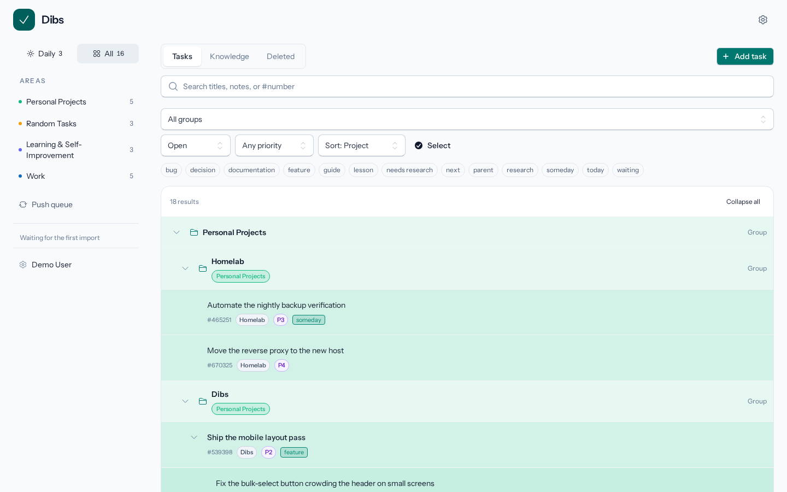
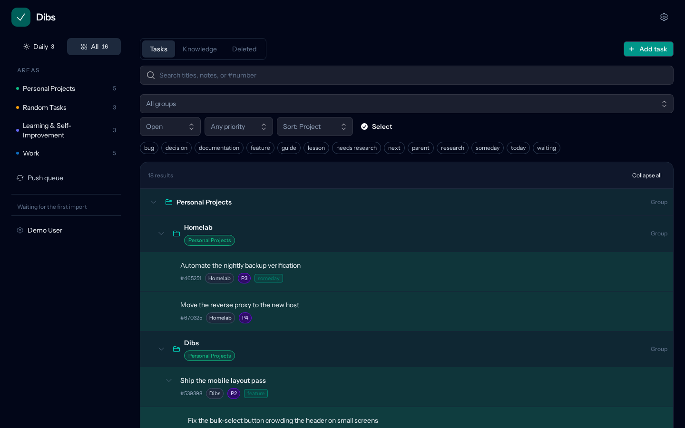
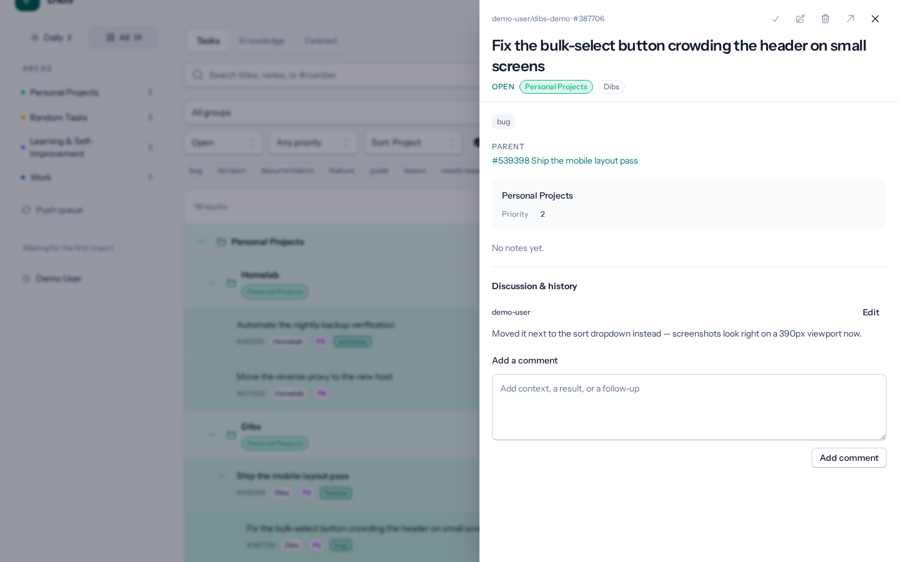
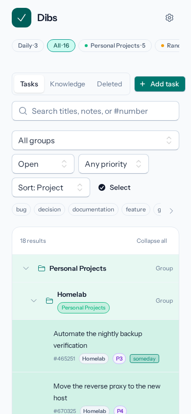
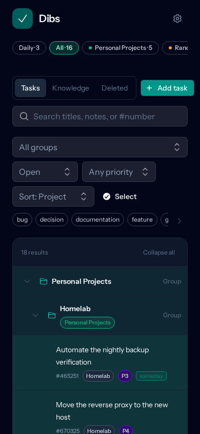

# Dibs

[](https://github.com/loki495/dibs/actions/workflows/ci.yml)
[](https://codecov.io/gh/loki495/dibs)
[](LICENSE)

A self-hosted task tracker built for AI agents as first-class users, not just a todo app they can
also poke at. Any agent — a fresh session with zero context, a long-running worker, a different
tool entirely — can connect to the same host-local MCP server and ask "what's open?", either
across everything or scoped to one project, and pick up exactly where the last session left off.
The same server lets agents save plans, track progress, and record project-specific research and
decisions as they work, and a claim/heartbeat/release/complete lifecycle keeps multiple agents (or
the same agent across sessions) from duplicating or colliding on the same task. You can also just
use it yourself as a regular todo list — the web UI and the agent surface share the same data and
the same Actions underneath. Optionally mirrored to GitHub Issues and Projects asynchronously;
local SQLite is authoritative.

**Stack:** Laravel 13, Livewire 4, PHP 8.5, SQLite, Tailwind 4, Flux UI.

<p>
  
  
</p>
<p>
  
  
  
</p>

*(Screenshots show seeded sample data — see `database/seeders/DemoSeeder.php`.)*

## Quick start

Requires Docker and Docker Compose.

```bash
git clone https://github.com/loki495/dibs.git
cd dibs
bash docker/setup.sh
docker compose exec -u www-data app php artisan todo:user
```

The last command creates your login (name, email, and a password of at least 12 characters —
there's no public registration). Then visit `http://localhost:8095` (override the port with
`APP_PORT` in `.env`).

Running behind a reverse proxy? See `docker/compose.traefik.example.yml` for a working
label-based Traefik example.

Want to look around with realistic sample data instead of an empty workspace?
`docker compose exec -u www-data app php artisan db:seed --class="Database\Seeders\DemoSeeder"`
adds a few dozen fake tasks across areas, groups, priorities, and labels. It's meant for a
fresh database — don't run it against one you care about.

### Connecting to GitHub (optional)

Dibs works as a local-only task tracker out of the box. To sync with GitHub Issues/Projects,
set these in `.env`:

- `DIBS_GITHUB_OWNER` / `DIBS_GITHUB_REPO` — the repository to mirror issues to/from
- `GITHUB_TOKEN` — a personal access token (see scopes below)
- `GITHUB_PROJECT_NUMBERS` — which GitHub Projects (v2) to show as areas

**Token scopes.** Dibs reads/writes Issues (title, body, labels, parent links, comments) and
Projects v2 item fields (Status, Group, Priority, Planned, Due) on the one repo/owner
configured above — it never touches any other repository or org-level setting. Least-privilege
scopes:

- **Classic PAT:** `repo` (issue read/write requires full repo scope even for a public repo —
  GitHub has no narrower classic scope for issues) + `project` (Projects v2 field mutations).
- **Fine-grained PAT:** scope it to the one target repository, with repository permission
  **Issues: Read and write**, plus account-level permission **Projects: Read and write** (Projects
  v2 for a user-owned project isn't a per-repository permission, even when the project only
  tracks that repository's issues).

Either token type grants Dibs the ability to edit/close issues and Project fields on the
configured repo — treat it with the same care as any other write-capable credential, and scope
a fine-grained token to nothing beyond what's listed above.

Local edits queue automatically and push to GitHub in the background; a manual
**Refresh from GitHub** button pulls the latest.

## Activity log

**Activity** (settings menu → Activity, or `/activity`) shows every MCP tool call and the data changes
Dibs has recorded, in two logs you switch between. Filter by date range, tool or action, status,
category, source, or free text; expand an entry for its redacted arguments or its field-by-field diff;
follow the link from an MCP call to the changes it made (and back); or **Clear** a log. Anything that
looks like a token, secret, password, authorization or key is redacted before it is stored, so a
capability token never reaches the page. Changes are recorded by the write paths instrumented so far
(issue create/update/revise, parent moves, Project/Group assignment and labels), with more being added.

Entries older than `DIBS_ACTIVITY_MCP_RETENTION_DAYS` / `DIBS_ACTIVITY_CHANGE_RETENTION_DAYS` (default
30 days each; `0` keeps that log forever) are pruned daily by `php artisan activity:prune`.

## Running checks

```bash
composer pint      # code style (auto-fixes)
composer phpstan    # static analysis
composer rector      # modernization (dry-run only)
composer pest        # tests
```

## Agent integration

Dibs exposes a host-local stdio MCP server (`php artisan mcp:start todo`) that any agent (Claude,
Codex, etc.) can connect to for:

- **Discovering what exists** — `todo_metadata` lists every area with its Groups and Priority options, and every label with its id, description and usage count, plus how to attach or create each; search it with `query` before inventing a new label or Group.
- **Cold-start orientation** — `todo_context` and `todo_list` answer "what's open?" with no prior
  state needed, across every project or scoped to one, so a brand-new session (or a different
  agent picking up someone else's work) can get oriented and start immediately.
- **Finding related material** — `todo_search` searches titles and bodies across tasks, plans,
  and knowledge, including closed records. Ranked results include short excerpts so agents can
  choose what to read in full without opening every match.
- **Plans and progress** — `todo_scaffold_plan` and `todo_revise` let an agent record a multi-step
  plan up front and keep it current as work progresses, so the plan itself — not a chat transcript
  — is the durable record.
- **Project knowledge** — research, lessons, and decisions get saved as their own records
  (`todo_create` with a knowledge label), discoverable later instead of buried in a comment
  history no one re-reads.

For example, call `todo_search` with:

```json
{"query": "queue retries", "perPage": 5}
```

Every term must match somewhere in the title or body. Add `state`, or filter by labels
(`labels`, `anyLabels`, `excludeLabels`), Projects and Groups (`areas`/`areaNames`,
`groups`/`groupNames`) and issue trees (`parentId`, with `descendants` for everything beneath
it), in any combination — with no keywords at all if you like; use `todo_show` for full detail on selected results. Search currently
covers keywords in titles and bodies, not comments or semantic similarity.

Claim/heartbeat/release/complete keeps multiple agents (or the same agent across sessions) from
duplicating or colliding on the same task, all without ever handling your GitHub token — every
write goes through the same Actions the web UI uses. Completing a task can carry a closing note,
a reason (`COMPLETED`/`NOT_PLANNED`), and references, all visible afterward via `todo_show`. See
[`docs/agent-interface.md`](docs/agent-interface.md) for the full tool contract, and a JSON CLI
fallback (`php artisan todo:agent:*`) for scripting or recovery.

To teach an agent how to use these tools well, drop [`skills/dibs/SKILL.md`](skills/dibs/SKILL.md)
into its skills directory (or paste it into its instructions). It's a short, generic guide in the
Agent Skills format (a `SKILL.md` with `name`/`description` frontmatter) covering cold start,
plans, claims, and recording research and lessons.

## Learn more

- [`docs/architecture.md`](docs/architecture.md) — data model and sync design
- [`docs/agent-interface.md`](docs/agent-interface.md) — MCP/CLI contract for agents
- [`skills/dibs/SKILL.md`](skills/dibs/SKILL.md) — a ready-to-use agent skill for working with Dibs
- [`docs/demo-hosting.md`](docs/demo-hosting.md) — how the public demo instance is built and deployed
- [`CONTRIBUTING.md`](CONTRIBUTING.md) — how to contribute
- [`CLAUDE.md`](CLAUDE.md) — conventions for AI coding assistants working in this repo

## License

MIT — see [LICENSE](LICENSE).
