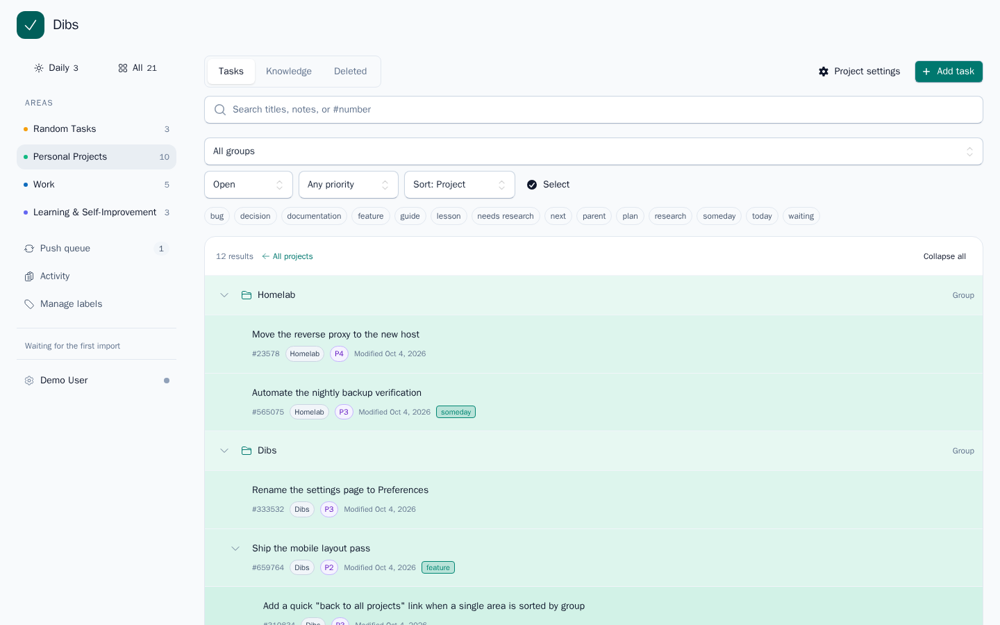
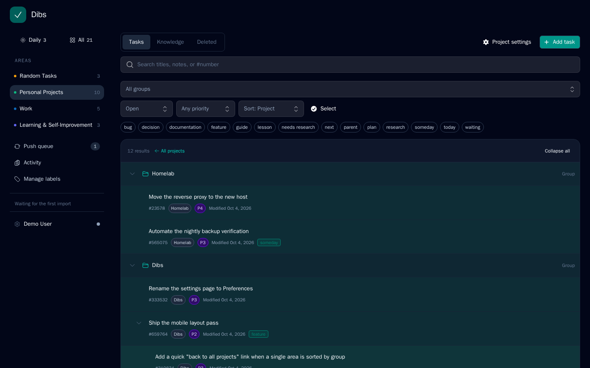
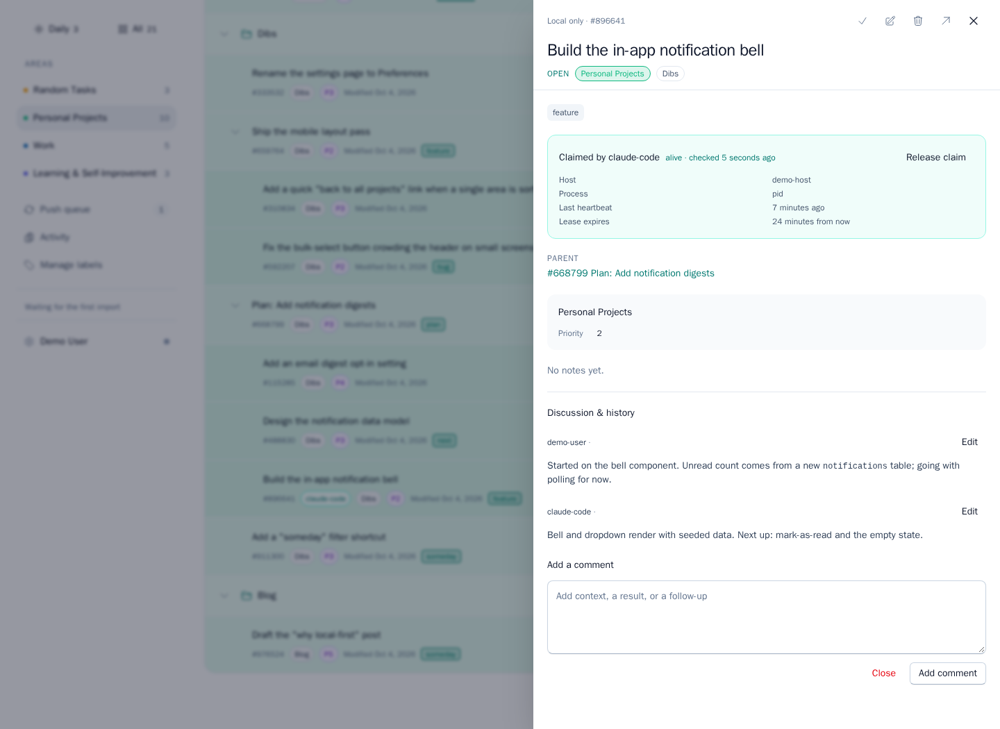
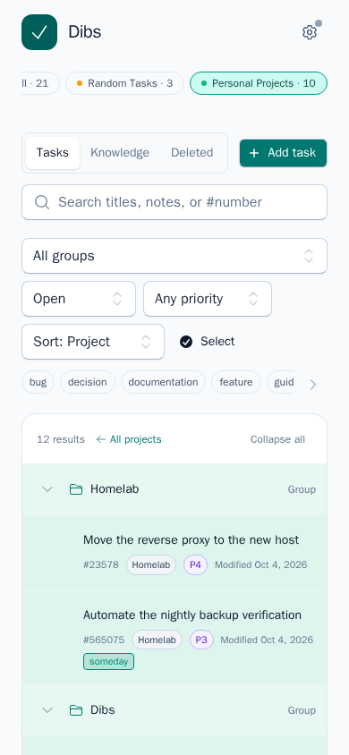
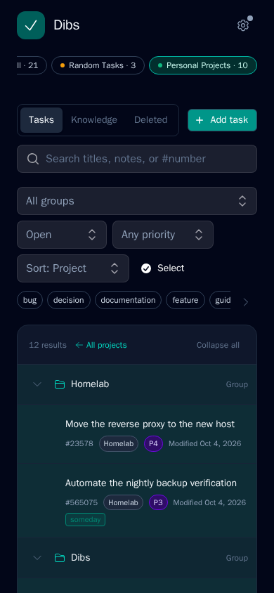

# Dibs

[](https://github.com/loki495/dibs/actions/workflows/ci.yml)
[](https://codecov.io/gh/loki495/dibs)
[](LICENSE)

A self-hosted task tracker built for AI agents as first-class users, not just a todo app they can
also poke at. Any agent — a fresh session with zero context, a long-running worker, a different
tool entirely — can connect to the same host-local MCP server and ask "what's open?", either
across everything or scoped to one project, and pick up exactly where the last session left off.
The same server lets agents save plans, track progress, and record project-specific research and
decisions as they work, and a claim/heartbeat/release/complete lifecycle keeps multiple agents (or
the same agent across sessions) from duplicating or colliding on the same task. You can also just
use it yourself as a regular todo list — the web UI and the agent surface share the same data and
the same Actions underneath. Optionally mirrored to GitHub Issues and Projects asynchronously;
local SQLite is authoritative.

**Stack:** Laravel 13, Livewire 4, PHP 8.5, SQLite, Tailwind 4, Flux UI.

> **Status: experimental alpha** (`v0.1.0-alpha.1`). Dibs has run the author's own task list, driven
> by coding agents over MCP, for about a month. It is suitable for personal, self-hosted use. Expect
> rough edges, schema changes between alpha releases, and the [known limitations](#known-limitations)
> below. A [public demo](https://dibs-demo.ac495.net) with throwaway data is the quickest way to look around.

<p>
  
  
</p>
<p>
  
  
  
</p>

*(Screenshots show seeded sample data — see `database/seeders/DemoSeeder.php`.)*

## Quick start

Requires Docker and Docker Compose.

```bash
git clone https://github.com/loki495/dibs.git
cd dibs
bash docker/setup.sh
docker compose exec -u www-data app php artisan todo:user
```

The last command creates your login (name, email, and a password of at least 12 characters —
there's no public registration). Then visit `http://localhost:8095` (override the port with
`APP_PORT` in `.env`).

**Host UID.** The containers run as the user who owns the checkout, so they can write the bind-mounted
`database/`, `storage/` and `vendor/`. `setup.sh` writes the checkout directory's owner UID and GID to
`DIBS_UID` and `DIBS_GID` in `.env`, unless they're already set there, so a checkout owned by a service
account works too and your own values always win. The image build remaps `www-data` to them, and the
`app-test` and `node` services run as them. Blank or missing values mean 1000. If you change them later,
rebuild: `docker compose --profile test build`, then `docker compose up -d`.

Rootless Docker or Podman is untested. There, container root is your host user and any other container
UID maps to a subordinate ID (`/etc/subuid`), which can't write your checkout. `DIBS_UID=0` doesn't
help: the `web` container's Apache refuses to run as root. Instead, keep `DIBS_UID`/`DIBS_GID` at, say,
1000 and give the subordinate IDs they map to ownership of the checkout (with Podman,
`podman unshare chown -R 1000:1000 .`).

`setup.sh` starts three containers: `web` serves the UI, `scheduler` drains the GitHub push queue
and prunes the activity log, and `app` is where agents and Artisan commands run
(`docker compose exec … app …`). `app` shares the host's PID namespace so it can check that a
claiming agent's process is still alive; its main process (`php artisan dibs:claims:watch`) does that
every 30 seconds and records the result, which is what the UI shows next to a claim. See
[SECURITY.md](SECURITY.md) for what that implies.

Running behind a reverse proxy? See `docker/compose.traefik.example.yml` for a working
label-based Traefik example; the labels go on the `web` service. Behind HTTPS, also set
`APP_URL`, `SESSION_SECURE_COOKIE=true` and `TRUSTED_PROXIES` in `.env` (see the comments in
`.env.example`).

Want to look around with realistic sample data instead of an empty workspace?
`docker compose exec -u www-data app php artisan db:seed --class="Database\Seeders\DemoSeeder"`
adds a few dozen fake tasks across areas, groups, priorities, and labels. It's meant for a
fresh database — don't run it against one you care about.

### Connecting to GitHub (optional)

Dibs works as a local-only task tracker out of the box. With `DIBS_GITHUB_OWNER` and
`DIBS_GITHUB_REPO` left blank, tasks, labels, comments, claims and plans live in one local
repository record that Dibs creates the first time it needs it. Nothing is queued for GitHub and
nothing contacts it: the push-queue drain skips itself and **Refresh from GitHub** is hidden. Areas,
Groups and Priority come from GitHub Projects, so a local-only instance has none. It organizes
work with labels and parent tasks instead.

To mirror to GitHub Issues/Projects, set these in `.env`:

- `DIBS_GITHUB_OWNER` / `DIBS_GITHUB_REPO` — the repository to mirror issues to/from
- `GITHUB_TOKEN` — a personal access token (see scopes below)
- `GITHUB_PROJECT_NUMBERS` — comma-separated numbers of the GitHub Projects (v2) to show as areas
  (blank syncs none)

**Token scopes.** Dibs reads/writes Issues (title, body, labels, parent links, comments) and
Projects v2 item fields (Status, Group, Priority, Planned, Due) on the one repo/owner
configured above — it never touches any other repository or org-level setting. Least-privilege
scopes:

- **Classic PAT:** `repo` (issue read/write requires full repo scope even for a public repo —
  GitHub has no narrower classic scope for issues) + `project` (Projects v2 field mutations).
- **Fine-grained PAT:** scope it to the one target repository, with repository permission
  **Issues: Read and write**, plus account-level permission **Projects: Read and write** (Projects
  v2 for a user-owned project isn't a per-repository permission, even when the project only
  tracks that repository's issues).

Either token type grants Dibs the ability to edit/close issues and Project fields on the
configured repo — treat it with the same care as any other write-capable credential, and scope
a fine-grained token to nothing beyond what's listed above.

Local edits queue automatically and push to GitHub in the background; a manual
**Refresh from GitHub** button pulls the latest.

**Switching a local-only instance to GitHub.** Set the variables above, then run the first import
(`scripts/github-pull`, or `php artisan todo:sync`). Until that import succeeds, a process
whose `DIBS_GITHUB_OWNER`/`DIBS_GITHUB_REPO` are set refuses to create a task or label (`todo_create`,
the capture form, new labels) and to save the UI edit form, with a message telling you to run it.
Everything else is accepted and written locally: `todo_update`/revise, comments, close/complete and
reopen, claims. Nothing is queued before the import, which then queues all of it. Your local data is
left untouched. The first import adopts the local repository record as the GitHub repository. Local
labels whose names match GitHub's labels merge with them. Every task, label, parent link, closed
state and comment created while local-only is then queued and pushed like any new write: each local
task becomes a new GitHub issue. A failed import changes nothing, so the instance stays local-only
and you can retry. Agent sessions and other processes that were already running pick up the switch
on their next write, without a restart: whether writes are mirrored is read from the database, not
from each process's environment. Going the other way is not supported. Once an instance has been
imported, its writes keep going to the imported repository and queueing pushes even if the two
variables are blanked, but nothing is pushed until they (and `GITHUB_TOKEN`) are set again for the
drain.

## Activity log

**Activity** (settings menu → Activity, or `/activity`) shows every MCP tool call and the data changes
Dibs has recorded, in two logs you switch between. Filter by date range, tool or action, status,
category, source, or free text; expand an entry for its redacted arguments or its field-by-field diff;
follow the link from an MCP call to the changes it made (and back); or **Clear** a log. Anything that
looks like a token, secret, password, authorization or key is redacted before it is stored, so a
capability token never reaches the page. Changes are recorded by the write paths instrumented so far
(issue create/update/revise, parent moves, Project/Group assignment and labels), with more being added.

Entries older than `DIBS_ACTIVITY_MCP_RETENTION_DAYS` / `DIBS_ACTIVITY_CHANGE_RETENTION_DAYS` (default
30 days each; `0` keeps that log forever) are pruned daily by `php artisan activity:prune`.

If the browser loses contact with the server (a dropped connection, or a request still pending after
`DIBS_LIVEWIRE_REQUEST_TIMEOUT` seconds, default 20, `0` = no timeout), a banner at the bottom of the
page says so and offers a Reload, instead of the page silently ignoring taps. While a request or page load
is in flight, a thin bar shows at the top and the lists dim (after `DIBS_LOADING_INDICATOR_DELAY_MS`
milliseconds, default 150, so quick requests don't flicker).

## Agent integration

### Connect an agent

Dibs exposes a host-local stdio MCP server named `todo` (`php artisan mcp:start todo`). The agent
launches it as a child process through the `app` service, which is the one that shares the host's PID
namespace (claim liveness needs that; `web` only serves HTTP). The command is the same for every client:

```bash
docker compose -f /path/to/dibs/docker-compose.yml exec -T -u www-data app php artisan mcp:start todo
```

Use an absolute path to your checkout, and make sure the containers are up (`docker compose up -d`).
`-T` is required: stdio carries the JSON-RPC stream, so no TTY may be allocated.

**Claude Code**

```bash
claude mcp add dibs -- docker compose -f /path/to/dibs/docker-compose.yml exec -T -u www-data app php artisan mcp:start todo
```

Or commit/share it as a `.mcp.json`:

```json
{
  "mcpServers": {
    "dibs": {
      "type": "stdio",
      "command": "docker",
      "args": ["compose", "-f", "/path/to/dibs/docker-compose.yml", "exec", "-T", "-u", "www-data", "app", "php", "artisan", "mcp:start", "todo"]
    }
  }
}
```

**opencode** (`opencode.json`)

```json
{
  "$schema": "https://opencode.ai/config.json",
  "mcp": {
    "dibs": {
      "type": "local",
      "command": ["docker", "compose", "-f", "/path/to/dibs/docker-compose.yml", "exec", "-T", "-u", "www-data", "app", "php", "artisan", "mcp:start", "todo"],
      "enabled": true
    }
  }
}
```

**Any other MCP client** that can launch a stdio server: give it that same command (executable
`docker`, the rest as arguments). The `dibs` label is yours to choose; the tools are always `todo_*`.

Agent sessions must reconnect after the `app` container restarts (a rebuild, `docker compose restart`,
an upgrade): the MCP server is a process inside it, so a restart drops the connection. Call `todo_status`
first in a session to confirm you reached the intended instance. Teach the agent how to use the tools
with [`skills/dibs/SKILL.md`](skills/dibs/SKILL.md), below.

### What agents can do


- **Discovering what exists** — `todo_metadata` lists every area with its Groups and Priority options, and every label with its id, description and usage count, plus how to attach or create each; search it with `query` before inventing a new label or Group.
- **Cold-start orientation** — `todo_context` and `todo_list` answer "what's open?" with no prior
  state needed, across every project or scoped to one, so a brand-new session (or a different
  agent picking up someone else's work) can get oriented and start immediately.
- **Finding related material** — `todo_search` searches titles and bodies across tasks, plans,
  and knowledge, including closed records. Ranked results include short excerpts so agents can
  choose what to read in full without opening every match.
- **Checking before re-reading** — `todo_peek` reports id/title/revision/state for a batch of ids
  in one cheap call, no body, so a cached record can be checked for change without paying for a
  full `todo_show`; `todo_show`'s `maxBodyLength` gives a cheap truncated preview for the same
  reason.
- **Plans and progress** — `todo_scaffold_plan` and `todo_revise` let an agent record a multi-step
  plan up front and keep it current as work progresses, so the plan itself — not a chat transcript
  — is the durable record.
- **Project knowledge** — research, lessons, and decisions get saved as their own records
  (`todo_create` with a knowledge label), discoverable later instead of buried in a comment
  history no one re-reads.

For example, call `todo_search` with:

```json
{"query": "queue retries", "perPage": 5}
```

Every term must match somewhere in the title or body. Add `state`, or filter by labels
(`labels`, `anyLabels`, `excludeLabels`), Projects and Groups (`areas`/`areaNames`,
`groups`/`groupNames`) and issue trees (`parentId`, with `descendants` for everything beneath
it), in any combination — with no keywords at all if you like; use `todo_show` for full detail on selected results. Search currently
covers keywords in titles and bodies, not comments or semantic similarity.

Claim/heartbeat/release/complete keeps multiple agents (or the same agent across sessions) from
duplicating or colliding on the same task, all without ever handling your GitHub token — every
write goes through the same Actions the web UI uses. Completing a task can carry a closing note,
a reason (`COMPLETED`/`NOT_PLANNED`), and references, all visible afterward via `todo_show`; `todo_reopen` puts a closed task back to open. See
[`docs/agent-interface.md`](docs/agent-interface.md) for the full tool contract, and a partial JSON CLI
fallback (`php artisan todo:agent:*`, nine commands, not the full tool set) for scripting or recovery.

To teach an agent how to use these tools well, drop [`skills/dibs/SKILL.md`](skills/dibs/SKILL.md)
into its skills directory (or paste it into its instructions). It's a short, generic guide in the
Agent Skills format (a `SKILL.md` with `name`/`description` frontmatter) covering cold start,
plans, claims, and recording research and lessons.

## Owner auto-login (optional)

Off by default. For a single-owner deployment you can skip the login page for yourself with two `.env` settings:

| Variable | Effect |
|---|---|
| `AUTO_LOGIN_EMAIL` | An existing account to sign in as. It is never created. In demo mode it defaults to the demo account. |
| `AUTO_LOGIN_LAN=true` | Signs that account in for requests that carry no Cloudflare edge header (`CF-Connecting-IP`/`CF-Ray`) and come from a private address. |

Requests that arrive through Cloudflare (tunnel or proxy) are never auto-logged-in and always use the normal login. LAN auto-login trusts the network position, so anyone on the trusted network is treated as the owner: only enable it on a network you control, and only when nothing but your tunnel and your LAN can reach the app (no public port-forward to Dibs or to a reverse proxy in front of it). Conditions that matter:

- **The address checked is Laravel's client IP.** That is the direct peer, unless the peer is listed in `TRUSTED_PROXIES`; then it's the client address that proxy put in `X-Forwarded-For` (the rightmost entry not itself a trusted proxy, so a client can't add a fake one in front).
- **Behind a reverse proxy (Traefik, nginx, Caddy), set `TRUSTED_PROXIES` to it.** Left blank, every request through the proxy arrives from its private Docker address and counts as LAN, whoever sent it. Requests through the Cloudflare tunnel carry Cloudflare's headers, so they aren't affected.
- **Never combine `AUTO_LOGIN_LAN` with `TRUSTED_PROXIES=*`.** Any client that reaches Dibs directly could then claim a LAN address in `X-Forwarded-For`.
- **Only RFC 1918 and IPv6 unique-local (`fc00::/7`) addresses count as LAN.** Loopback, link-local and CGNAT/Tailscale (`100.64.0.0/10`) addresses don't.

Apply a change with `docker compose up -d`; a plain image pull keeps the old environment. See `AutoLoginForTrustedRequests`.

## Backup, restore and upgrade

**What to keep:** `database/database.sqlite` (every task, comment, claim and queued GitHub push) and
`.env` (settings, `APP_KEY` and your GitHub token). Dibs has no built-in backup tooling. The database
runs in WAL mode, so don't copy the file by itself while the containers are busy. Take a consistent
snapshot instead:

```bash
docker compose exec -T -u www-data app php -r '(new PDO("sqlite:database/database.sqlite"))->exec("VACUUM INTO \"storage/backup.sqlite\"");'
mv storage/backup.sqlite ~/dibs-backup.sqlite   # the target file must not already exist
cp .env ~/dibs-backup.env
```

**Restore:** `docker compose down`, put the snapshot back as `database/database.sqlite` (delete any
`database.sqlite-wal` and `database.sqlite-shm` beside it), restore `.env`, then `docker compose up -d`.
Without a GitHub mirror that is the whole job. With one, rows queued after the snapshot are gone, so run
**Refresh from GitHub** and compare.

**Upgrade:** back up first, then

```bash
git pull
bash docker/setup.sh                # rebuilds images, installs dependencies, runs migrations, rebuilds assets
docker compose restart app web scheduler  # long-running processes still hold the old code
```

`setup.sh` already runs `docker compose up -d`, so the `web` service appears on the first upgrade
from an older checkout. If you start it by hand instead, use `docker compose up -d app web scheduler`.
`--remove-orphans` is not needed: no service was removed.

**Upgrading an install from before the `web` service.** HTTP is now served by `web`, not `app`
(which no longer exposes a port). Move any Traefik labels, networks, port mappings or other overrides
for the HTTP side from `app` to `web` (see `docker/compose.traefik.example.yml`), or the site stops
answering. Migrations run as part of `setup.sh`; to run them alone see below.

To run migrations alone: `composer artisan -- migrate`, or without Composer on the host,
`docker compose exec -T -u www-data app php artisan migrate --force`. Reconnect any agent sessions
afterwards.

## Known limitations

- **One repository per instance.** An instance mirrors the one `DIBS_GITHUB_OWNER`/`DIBS_GITHUB_REPO`, or
  none (local-only). Running several workspaces means running several instances.
- **Single user.** Accounts are created from the command line (`todo:user`) and all of them see the same
  workspace; there are no per-user permissions or ownership. Claims are scoped to one local database.
- **Linux `/proc` is needed for claim liveness.** Verifying that a claiming agent's process is alive reads
  `/proc/<pid>/stat` through the `app` container's host PID namespace. Elsewhere, claims still work but
  are recorded as unverified and only expire with their lease.
- **Natural-language capture isn't built.** Only the host bridge mechanism exists
  ([`docs/capture-bridge.md`](docs/capture-bridge.md)); nothing in the app calls it.
- **No built-in backup tooling.** Back up `database/database.sqlite` yourself (see above).
- **Areas, Groups and Priority come only from GitHub Projects.** A local-only instance has none and
  organizes work with labels and parent tasks.
- **Auto-login is LAN-only.** Optional owner auto-login applies to private-network requests and never to
  traffic that arrives through Cloudflare, which always uses the normal login.

## Design notes

- **One write path.** Typed Actions are shared by the web UI, the Artisan CLI and the MCP tools, and an
  architecture test (`tests/Feature/Architecture/NoDirectWritesInUiOrMcpTest.php`) fails the build if the UI,
  MCP or HTTP layers write to the database themselves. See [architecture](docs/architecture.md#push-queue-and-write-model).
- **Claims bound to a process.** A claim records the agent's pid and the process start time from
  `/proc/<pid>/stat` (so a reused pid can't keep it alive) plus a capability token stored only as a hash;
  a background watcher records liveness for the UI. See [claims](docs/agent-interface.md#claims-and-checkpoints).
- **Local-first writes, async mirror.** A write commits to SQLite and enqueues a GitHub push. The drain
  retries transient failures with backoff that honours GitHub's rate-limit headers, and idempotent writes
  commit atomically with their receipt. See [push queue](docs/architecture.md#push-queue-and-write-model).
- **Local-only mode with adoption.** With no GitHub repository configured, everything works locally; the
  first GitHub import adopts the local repository and queues what was created. See
  [local-only mode](docs/architecture.md#sync-authority).
- **Tools validate their own input.** `laravel/mcp` doesn't enforce a tool's declared JSON Schema, so every
  write tool validates its arguments itself. See [MCP tools](docs/agent-interface.md#mcp-tools).

## Running checks

Pint, PHPStan, Rector (dry-run) and Pest run inside the `app` container. The `composer` scripts below are
host-side wrappers around `docker compose exec`, so they need Composer on the host. Without it, run the
raw form shown beside each.

| Check | Composer wrapper | Raw form |
|---|---|---|
| Code style (auto-fixes) | `composer pint` | `docker compose exec -T -u www-data app vendor/bin/pint` |
| Static analysis | `composer phpstan` | `docker compose exec -T -u www-data app vendor/bin/phpstan analyse --memory-limit=512M` |
| Modernization (dry-run only) | `composer rector` | `docker compose exec -T -u www-data app vendor/bin/rector process --dry-run` |
| Tests | `composer pest` | `docker compose exec -T -u www-data app vendor/bin/pest` |
| Browser tests | `composer pest:browser` | `docker compose --profile test run --rm app-test vendor/bin/pest tests/Browser` |
| Any Artisan command | `composer artisan -- <command>` | `docker compose exec -T -u www-data app php artisan <command>` |

## Learn more

- [`docs/architecture.md`](docs/architecture.md) — data model and sync design
- [`docs/agent-interface.md`](docs/agent-interface.md) — MCP/CLI contract for agents
- [`skills/dibs/SKILL.md`](skills/dibs/SKILL.md) — a ready-to-use agent skill for working with Dibs
- [`docs/demo-hosting.md`](docs/demo-hosting.md) — how the public demo instance is built and deployed
- [`CONTRIBUTING.md`](CONTRIBUTING.md) — how to contribute
- [`CLAUDE.md`](CLAUDE.md) — conventions for AI coding assistants working in this repo

## License

MIT — see [LICENSE](LICENSE).
